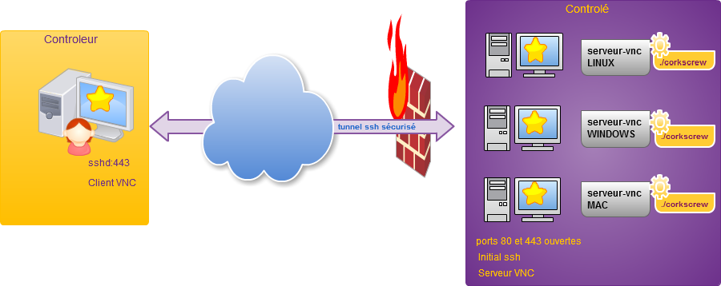
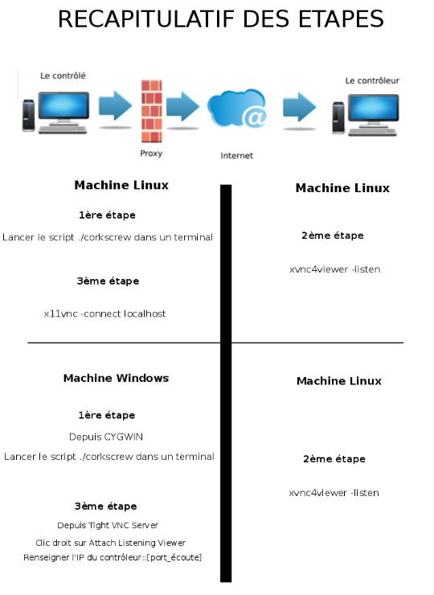

% Administration à distance à travers un proxy HTTP/HTTPS
% Fatemeh Zohari ; Florian Legrand ; Jean Canivez
% 30 Mars 2017

# Introduction

## Objective

### 

- Outils sous licence libre
- Données circulent chiffrées
- Le plus simple possible (accessible à un non-informaticien) 

# VNC

## VNC

### Virtual Network Computing

- Côté client :  xtightvncviewer
- Côté serveur : x11vnc

# Reverse VNC

## Reverse VNC

###  Linux - Linux

- Client qui écoute
- Serveur diffuse son écran

- Client : $ xvnc4viewer -listen
- Serveur : $ x11vnc -connect 172.18.48.231:5500

### Linux - Windows

- Client linux : $ xvncviewer -listen
- Serveur Windows : TightVNC

# SSH au dessus du proxy HTTP/HTTPS

## SSH au dessus du proxy HTTP/HTTPS

### Outils
- Choix d'utiliser Corksrew

### Avantage
- Facilité d'installation et de configuration

### Désavantage
- Besoin d'une redirection de port 

### Configuration
- Modification du fichier .ssh/config				
- Rédaction de script

## SSH au dessus du proxy HTTP/HTTPS

### LINUX vers LINUX

- Installation et configuration de Corkscrew
- Via deux choix possible : Manuellement ou via un script
- Choix de la méthode via un script d'éxécution (gain de productivité et accessibilité)

### WINDOWS vers LINUX

- Installation Cygwin et Corkscrew
- Mêmes cas et choix que pour Linux

# Administration à distance à travers un proxy HTTP/HTTPS

## Administration à distance à travers un proxy HTTP/HTTPS

##

# Conclusion

## Conclusion

### 

- Prendre le contrôle d'un pc à distance situé derrière un proxy

- Découverte de nouveaux outils de collaboration et d'administration

- Gain en capacités

### Remerciements

- A Mr Beaufils et Mr Peter
- Les administrateurs de l'IUT pour le prêt de matériel 
- Thibeuf Antoine pour la finalisation

