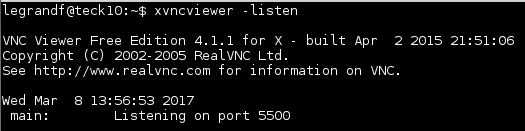
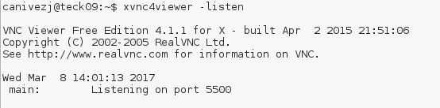
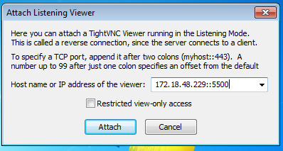

# Presentation

>## Objective of the project

The main  objective of the project is to set up a procedure allowing to take control (or to see)the screen
of a machine connected to a private network which has access to the internet only via a Web proxy from
a machine with a public address on the Internet.  
The machine to attend (the one who offers her screen and who is on the private network) can work under
Linux,Windows or Mac OS X.  
The machine of assistance, which assists,(the one who looks at the screen and who public on the network) works under Linux only.  
The entire used tools must be available with a free licence.  
The data circulating between both machines must be encrypted.  
The procedure to be set up on the machine to attend has to be the simplest possible (approachable to a non-IT specialist) and if possible write a script to automate him

>## Study of the solutions

>## Advantages of the solution

# Implementation

To bring to a successful conclusion, we cut the tasks to arrive at the final result. We acquained first
of all on the functioning of VNC. We then coupled both protocols. The last stage consisted in crossing
the proxy via  `corkscrew` through SSH.  

>## SSH above the proxy HTTP/HTPPS  

  

>>### Automation script  

># VNC connection with Linux machine  

Virtual Network Computing (VNC) is a software used to connect in a distant computer.
He allows to pass on the keyed in as well as the clicks of the mouse from a computer to the other one.
It allows simply to take control of a distant machine whether she is in local or by means of internet.
To use him, we need a `VNC customer` and a `VNC server`. The VNC customer connects on a server and allows to take his control.  

  

Within the framework of our project, we need to use VNC in `reverse mode`. It's not the customer who
connects to the server but the opposite. The customer is going to wait that a server comes to connect to him.
Thus we set up it `reverse VNC` between two machine situated on the same local area network (without crossing proxy).  

>>### Reverse VNC

We are thus going to take control of a Linux machine by means of another Linux machine situated on the same private network (Practical classes).  
The ip address od the machine which takes control is : 172.18.48.231.  
The listening port is : 5500.  
For the customer, its necessary to download the package `xtightvncviewer`.  
Then, it's necessary to execute this order :  
```
$ xvncviewer -listen
```

  

This order allows to the customer to listen to on the port 5500 ans waits that a server comes to listen
to on the same port to establish the connection.  
Now, it's necessary to launch the server on the other machine. For the server, it's necessary to install
the package `x11vnc`.  
Then, you have to launch this order :  
```
$ x11vnc -connect [@ip-machine-control]:[listening-port]
```
In our example :  
```
$ x11vnc -connect 172.18.48.231:5500
```
The customer took up the server machine. Reverse VNC works between two machines Linux, it's now necessary
to obtain the same result between a Windows and Linux Machine.  

>## VNC connection with Windows machine

Now, the maintaining purpose ,it's to find a VNC server (free) under windows. We choose the server
`TightVNC`. It's a freeware and he has a good community.  

>>### Reverse VNC

As on Linux machine, it nedds to use VNC in `reverse mode`. On the customer machine (Linux), it's necessary
to launch the same order seen previously:  
```
$ xvncviewer -listen
```
The customer is going to listen on the `5500 port` and to wait that a server spreads him his screen. 

  

On the server (Windows machine), we need to install `TightVNC`. Once `TightVNC` was installed and
the customer was launched. We need to start `TightVNC Server`(service mode). For the reverse mode, make
a right clik on the lower right icon in the tasks bar and clik on `attach listening viewer`.  

  

A dialog box appears which one it's necessary to enter the address of the machine with which we want
to share the connection as well as the listening port. Click on `attach` to validate.  

  

`Reverse vnc` works at the moment on Linux and Windows. 
The following stage consists to execute puts `reverse vnc` through `ssh`.  

># VNC above SSH without proxy  

SSH is a communication protocol allowing to make operations reassured on a non-secure network. By extension it is also the program which implements this protocol.

Historically he is built, in particular, to execute orders via a shell on a distant machine from a local machine. It is of her that comes his name Secure SHell.

He allows to establish a connection secure and calculated between both machines then executes a shell on the distant machine in which the wanted orders are executed. The user of the local machine must be able to become identified on the distant machine as a user existing on this one.

Several methods of authentification are possible.

The supply/check of the password of the distant user by the local user a handshake calculated via the provision of the distant user by the local user of a public key

Under Unix, to use SSH, it is simply necessary to install the package openssh for the part customer and openssh-server for the part waiter.

Under Debian GNU/Linux it means executing one of the two order following as administrator (root):


